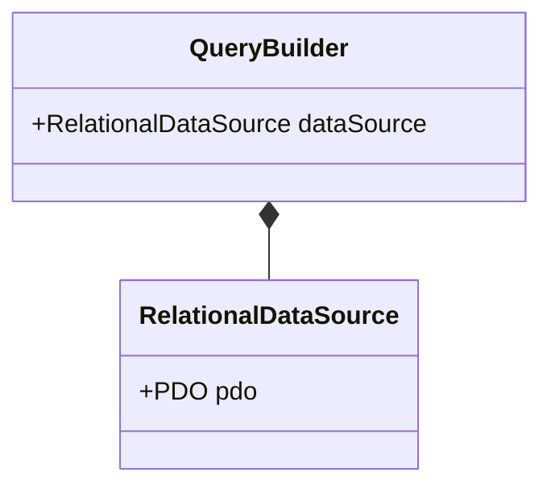

# Project

> 전자정보보안기술 23-1 학기 과제

## Github

- [https://github.com/jleem99/secu-tech-php-project](https://github.com/jleem99/secu-tech-php-project)

## Demo Website

- [project.jleem.com/secu-tech](project.jleem.com/secu-tech) (Hosted with AWS Elastic Beanstalk)

## How to Install

1. composer 패키지 매니저 설치
2. composer install
3. tailwindcss 빌드

## Project Structure

### TODO

- [ ] Controller 구현
- [ ] Persistent Layer 추상화
  - [ ] QueryBuilder
  - [ ] DataSource
  - [ ] CRUDService
- [ ] 비즈니스 로직 구현
- [ ] 뷰 구현
  - [ ] login.php
  - [ ] logout.php
  - [ ] ...
- [ ] Security Measures: 강의 내용 적용 / 가이드라인 체크리스트
- [ ] 외부 로깅 연결 (monolog <-> Amazon CloudWatch)
- [ ] 데모 사이트 배포 (AWS)
- [ ] 프로젝트 Dockerize
- [ ] 서비스 분리
- [ ] Installation Guide 제작
- [ ] 프로젝트 구조 도식 제작 (mermaid)

### Core Components



> QueryBuilder
>
-

> RelationalDataSource
>

## Security Measures

### SQL Injection

PDO의 Prepared Stmt. 사용
(`mysqli`의 prepared statement도 있지만, `RelationalDataSource`의 DB 종속성을 피하기 위하여 `PDO`를 사용)

e.g.

```php
$stmt = $this->pdo->prepare("INSERT INTO users (username, password) VALUES (?, ?)");
$stmt->execute([$username, $hashedPassword]);
```

→ `$username`, `$hashedPassword`를 쿼리 문자열 내에 raw 형태로 삽입하는 것이 아닌, 파라미터`(?, ?)` 형태로 입력받아 sanitize될 수 있도록 별도 처리

### Password Hashing & Salting

패스워드 해싱, 솔팅 과정을 위하여 php 자체 `password_hash`, `password_verify` 함수를 사용
(php 구현체에 따라 `bcrypt` 또는 `Argon2`의 패스워드 해싱을 사용하는 것으로 알려짐)

- `password_hash`: 솔트를 추가하여 패스워드를 해싱, 솔트와 해시 정보를 포함한 결과를 리턴
- `password_verify`: 앞서 `password_hash` 과정의 출력물에서 솔트를 추출, 주어진 해시와 비교하여 암호가 유효한지 체크
→ `src/services/AuthService.php`에 구현

## Notable Things

- MVC 패턴 구현 (부분적)
- PHP의 패키지(라이브러리) 사용을 위해 패키지 관리자인 `composer` 사용
- Dependency Injection을 위해 composer 라이브러리 `php-di`를 사용
- 스타일링을 위해 tailwindcss 사용
- 서버 Credentials의 경우 별도의 `.env` 파일로 관리
